# Guia para Uso de Markdown no GitHub

##  Índice
1. [Introdução](#introdução)
2. [Cabeçalhos](#cabeçalhos)
3. [Ênfase em textos](#ênfase-em-textos)
4. [Blocos de citação](#blocos-de-citação)
5. [Links](#links)
6. [Imagens](#imagens)
7. [Listas Não Ordenadas](#listas-não-ordenadas)
8. [Listas Ordenadas](#listas-ordenadas)
9. [Comentários](#comentários)
10. [Tabelas](#tabelas)
11. [Lista de Tarefas](#lista-de-tarefas)
12. [Emoji](#emoji)
13. [Mermaid](#mermaid)
14. [Editores Mermaid](#editores-mermaid)

---

## Introdução

Markdown é uma linguagem de marcação leve que permite formatar texto de maneira simples e legível, utilizando símbolos e caracteres comuns. Foi criada por John Gruber e Aaron Swartz em 2004...

---

## Cabeçalhos

Para cabeçalhos, utilizamos `#`...

# Cabeçalho 1
## Cabeçalho 2
### Cabeçalho 3
#### Cabeçalho 4
##### Cabeçalho 5
###### Cabeçalho 6

---

## Ênfase em textos

### Negrito  
**texto** → `**texto**`

### Itálico  
_texto_ → `_texto_`

### Riscado  
~~texto~~ → `~~texto~~`

### Linha Horizontal  
`---` ou `___`

---

## Blocos de citação

> "A simplicidade é a maior sofisticação."  
> – Leonardo da Vinci

---

## Links

[Epaminondas Lage](https://github.com/Epaminondaslage)

---

## Imagens

```

```


---

## Listas Não Ordenadas

- Item 1
- Item 2
  - Subitem 1
    - Subitem 2
       - Subitem 3

---

## Listas Ordenadas

1. Primeiro item
2. Segundo item
3. Terceiro item

---

## Comentários

### Comentário HTML

```
<!-- Este é um comentário -->
```

### Exemplos de Código:

#### HTML

```html
<!DOCTYPE html>
<html lang="pt-BR">
<head>
    <meta charset="UTF-8">
</head>
<body>
    <h1>Olá, Mundo!</h1>
</body>
</html>
```

#### Bash

```bash
ls
pip install pandas
```

#### CMD

```cmd
cd C:\\User\\YourUser\\Desktop
mkdir Folder
```

#### Python

```python
numero1 = float(input("Digite: "))
numero2 = float(input("Digite: "))
print(numero1 + numero2)
```

---

## Tabelas

| Nome | Tipo | Ataque |
| --- | --- | --- |
| Pikachu | Elétrico | 50 |
| Charmander | Fogo | 50 |

---

## Lista de Tarefas

- [x] Item completado
- [ ] Item não completado

---

## Emoji

- ⭐ (estrela): ⭐
- 🔥 (fogo): 🔥
- 📞 (telefone): 📞
- 💰 (dinheiro/saco de dinheiro): 💰
- 🏆 (troféu): 🏆
- 🎉 (festa/congratulações): 🎉
- 🔍 (lupa): 🔍
- 🗂️ (pasta de arquivos): 🗂️
- 📨 (carta recebida): 📨
- 📚 (livros/educação): 📚
- 💬 (balão de fala/mensagem): 💬
- 🌟 (estrela brilhante): 🌟
- 🔔 (sino): 🔔
- 🖊️ (caneta): 🖊️
- 📊 (gráfico): 📊
- 🧭 (bússola): 🧭
- 🔗 (corrente/link): 🔗
- 🏁 (bandeira de chegada): 🏁
- 🚧 (construção/obras): 🚧
- 🏠 (casa): 🏠
- 🌍 (globo terrestre/planeta): 🌍
- 📅 (calendário): 📅
- ⏰ (relógio/despertador): ⏰
- 🔋 (bateria): 🔋
- 🎥 (filmadora): 🎥
- 🌊 (onda): 🌊
- 🗳️ (urna de votação): 🗳️
- 🧩 (quebra-cabeça): 🧩
- ✈️ (avião/viagem): ✈️
- ✔️ Marca de verificação
- ❌ X vermelho
- ⚠️ Aviso
- 📅 Calendário
- 📌 Pin de localização
- 📊 Gráfico de barras
- 🔒 Cadeado fechado
- 🔓 Cadeado aberto
- 💡 Ideia
- 📈 Gráfico crescente
- 🔄 Atualizar/reciclar
- 🛠️ Ferramentas/reparo
- 🚀 Foguete/lancamento
- 💾 Salvar/disquete
- 📝 Bloco de notas
- ⏳ Ampulheta
- 🖥️ Computador
- 🌱 Planta/crescimento
- 🎯 Objetivo
- 💻 Laptop
- 📢 Alto-falante/anúncio
- 🔑 (chave): 🔑
- 🛒 (carrinho de compras): 🛒
- ✨ (brilho/efeito mágico): ✨
- 🌞 (sol): 🌞
- 🌜 (lua): 🌜
- 🌀 (ciclone/espiral): 🌀
- ⚙️ (engrenagem): ⚙️
- 🎵 (nota musical): 🎵
- 🌈 (arco-íris): 🌈
- 💦 (gota d'água): 💦
- 🥇 (medalha de ouro): 🥇
- 🍀 (trevo da sorte): 🍀
- 🎁 (presente): 🎁
- 📖 (livro aberto): 📖
- 🚀 (foguete): 🚀
- 🛑 (sinal de pare): 🛑
- 💎 (diamante): 💎
- 🛡️ (escudo): 🛡️
- 💥 (explosão): 💥
- 🚨 (sirene/alerta): 🚨
- 🎈 (balão): 🎈
- 🍎 (maçã): 🍎
- 🎮 (controle de videogame): 🎮
- 🖼️ (quadro/imagem): 🖼️
- 🏋️‍♂️ (levantador de peso): 🏋️‍♂️
- 🚴‍♀️ (ciclista): 🚴‍♀️
- 🐾 (pegadas): 🐾
- ⚖️ (balança/justiça): ⚖️
- 🛏️ (cama): 🛏️
- 🧹 (vassoura): 🧹
- 🥂 (brinde/taças): 🥂
- 🔦 (lanterna): 🔦
- 🗺️ (mapa): 🗺️
---

# Mermaid

### O que é Mermaid

**Mermaid** é uma **linguagem de marcação baseada em texto** que permite
criar **diagramas e gráficos automaticamente**, muito utilizada em
documentação técnica, especialmente em arquivos Markdown como
`README.md`.

---

###  Definição simples

**Mermaid é uma linguagem que transforma texto em diagramas.**

Você escreve um código simples e o Mermaid renderiza fluxos, UML, mapas
mentais, gráficos, diagramas de estado e muito mais.

---

###  Para que serve

-   Criar **diagramas rápidos** sem ferramentas gráficas.
-   Documentar sistemas, processos e fluxos.
-   Manter diagramas **dentro do próprio código**.
-   Facilitar colaboração em equipes.
-   Automatizar a criação de documentação técnica.

---

### Onde isso funciona no GitHub

Você pode usar 

- Arquivos Markdown (`README.md`, docs, etc.)
- Issues
- Pull requests
- Discussions
- Wikis

---

###  Exemplo de Mermaid

    ```mermaid
    flowchart LR
        A --> B
        B --> C
    ```
---

###  Tipos de diagramas suportados

-   **Flowchart** (Fluxograma)
-   **Sequence Diagram**
-   **Class Diagram (UML)**
-   **ER Diagram**
-   **Gantt Chart**
-   **Mindmap**
-   **State Machine**
-   **User Journey**
-   **Pie Chart**
-   **Git Graph**

---

###  Origem e contexto

Mermaid foi criada para facilitar a criação de diagramas diretamente no
código-fonte, evitando ferramentas externas como Draw.io.\
Hoje é suportada por:

-   GitHub\
-   GitLab\
-   Notion\
-   Obsidian\
-   Vários editores de Markdown


---


Em qualquer arquivo .md (README, por exemplo), escreva assim:

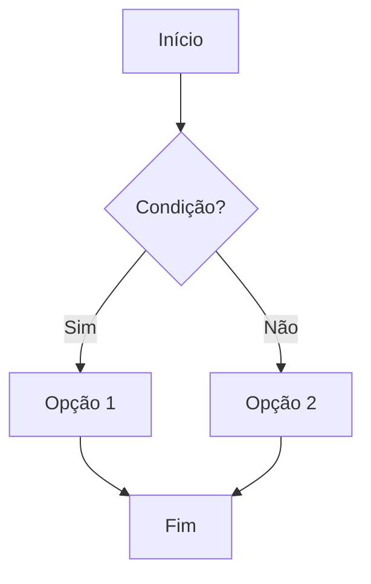
```mermaid
graph TD;
    A[Início] --> B{Condição?};
    B -->|Sim| C[Opção 1];
    B -->|Não| D[Opção 2];
    C --> E[Fim];
    D --> E;
```

Quando você salva e visualiza o arquivo no GitHub, ele renderiza o **fluxograma**, não o texto.


### Conferir a versão do Mermaid usada pelo GitHub

Se algum recurso novo não renderizar, você pode checar a versão do Mermaid que o GitHub está usando:

```mermaid
info
```

Isso mostra a versão e algumas infos no próprio render do diagrama. :contentReference[oaicite:2]{index=2}  

### Dica prática de fluxo de trabalho

1. **Teste o diagrama no Mermaid Live Editor** (mermaid.live) para ver se a sintaxe está certa. :contentReference[oaicite:3]{index=3}  
2. Quando estiver ok, copie o código.
3. Cole dentro de um bloco ` ```mermaid` no seu `README.md` ou documentação.
4. Commita e veja o resultado no GitHub.

###  Exemplos práticos de Mermaid (para usar no GitHub)


### 1. Fluxograma detalhado (Flowchart com estilos)

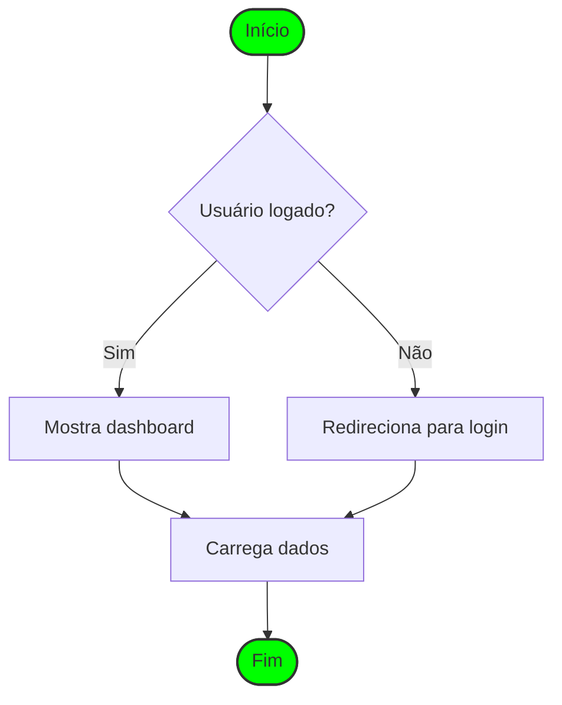
```mermaid
flowchart TD
    A([Início]) --> B{Usuário logado?}
    B -->|Sim| C[Mostra dashboard]
    B -->|Não| D[Redireciona para login]
    C --> E[Carrega dados]
    D --> E
    E --> F([Fim])

    style A fill:#0f0,stroke:#333,stroke-width:2px
    style F fill:#0f0,stroke:#333,stroke-width:2px
```

### 2. Diagrama de Classes UML

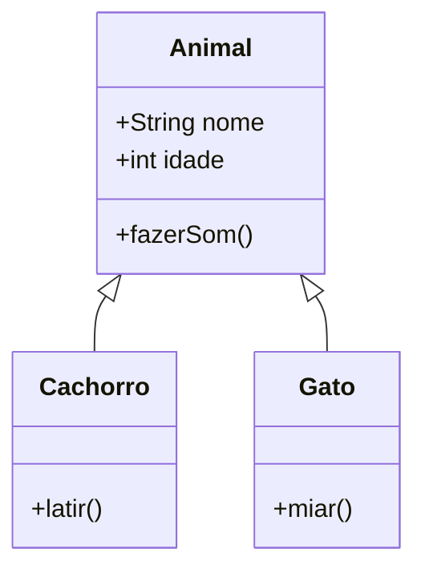
```mermaid
classDiagram
    class Animal {
      +String nome
      +int idade
      +fazerSom()
    }

    class Cachorro {
      +latir()
    }

    class Gato {
      +miar()
    }

    Animal <|-- Cachorro
    Animal <|-- Gato
```
---

### 3. Diagrama de Estado (State Machine)

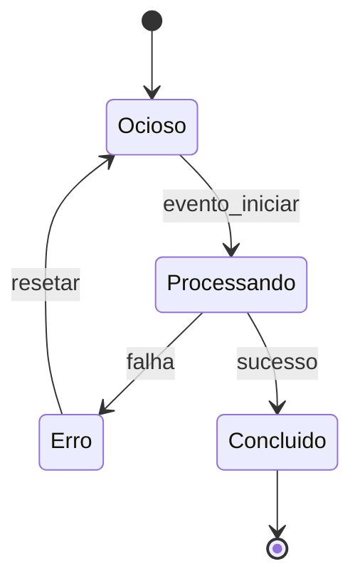
```mermaid
stateDiagram-v2
    [*] --> Ocioso
    Ocioso --> Processando : evento_iniciar
    Processando --> Erro : falha
    Processando --> Concluido : sucesso
    Erro --> Ocioso : resetar
    Concluido --> [*]
```

### 4. Diagrama de Entidade-Relacionamento (ERD)

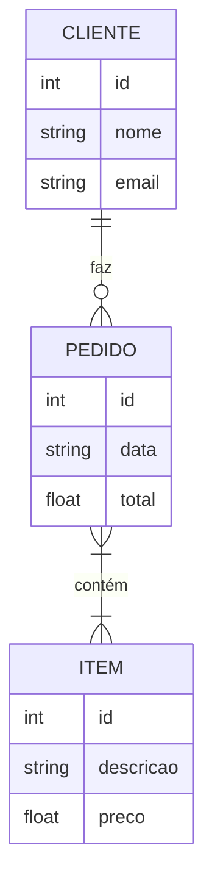
```mermaid
erDiagram
    CLIENTE ||--o{ PEDIDO : faz
    PEDIDO }|--|{ ITEM : contém
    CLIENTE {
        int id
        string nome
        string email
    }
    PEDIDO {
        int id
        string data
        float total
    }
    ITEM {
        int id
        string descricao
        float preco
    }
```

### 5. Diagrama de Jornada do Usuário

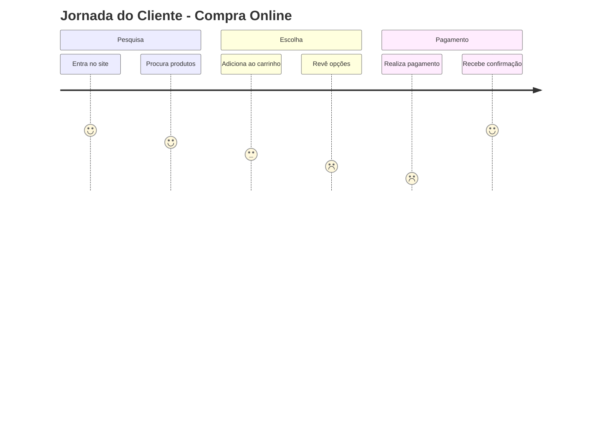
```mermaid
journey
    title Jornada do Cliente - Compra Online
    section Pesquisa
      Entra no site: 5
      Procura produtos: 4
    section Escolha
      Adiciona ao carrinho: 3
      Revê opções: 2
    section Pagamento
      Realiza pagamento: 1
      Recebe confirmação: 5
```

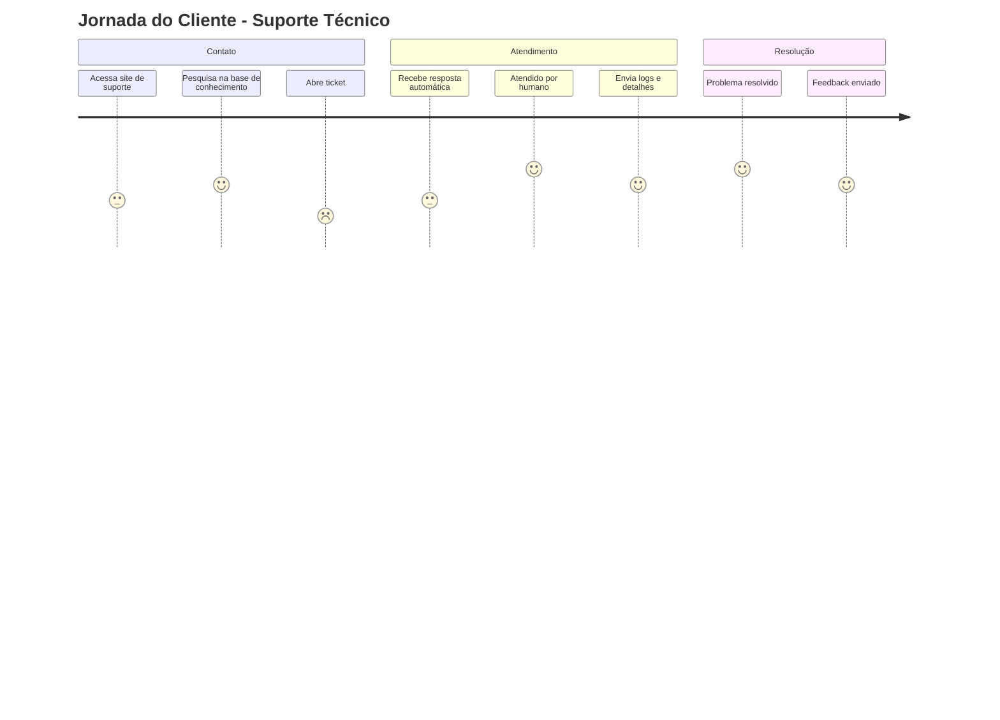
```mermaid
journey
    title Jornada do Cliente - Suporte Técnico
    section Contato
      Acessa site de suporte: 3
      Pesquisa na base de conhecimento: 4
      Abre ticket: 2
    section Atendimento
      Recebe resposta automática: 3
      Atendido por humano: 5
      Envia logs e detalhes: 4
    section Resolução
      Problema resolvido: 5
      Feedback enviado: 4
```

---

### 6. Mapa Mental (Mindmap)

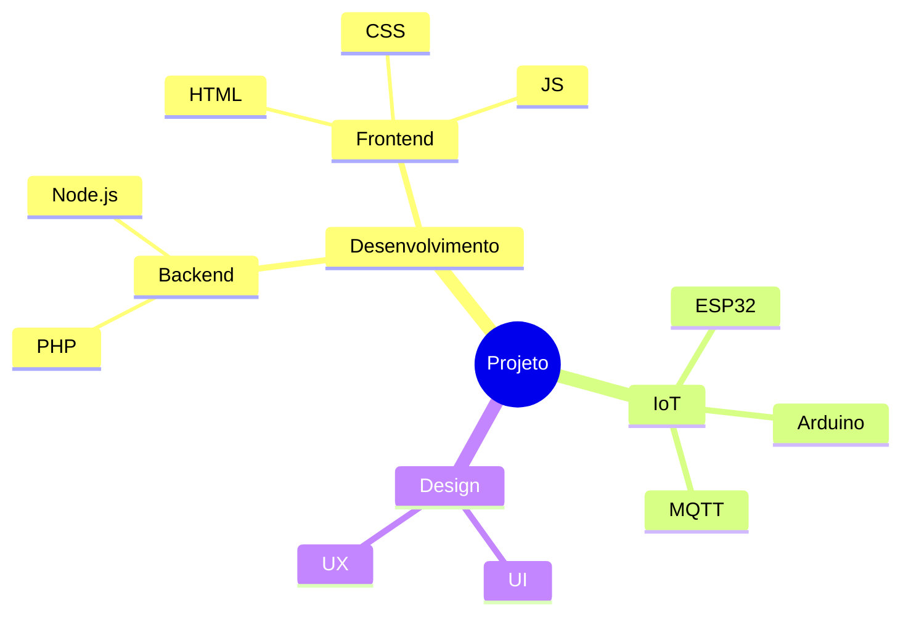
```mermaid
mindmap
  root((Projeto))
    Desenvolvimento
      Backend
        PHP
        Node.js
      Frontend
        HTML
        CSS
        JS
    IoT
      Arduino
      ESP32
      MQTT
    Design
      UI
      UX
```

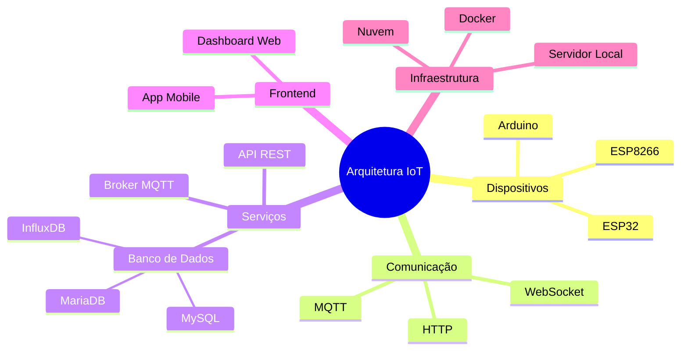
```mermaid
mindmap
  root((Arquitetura IoT))
    Dispositivos
      ESP32
      ESP8266
      Arduino
    Comunicação
      MQTT
      HTTP
      WebSocket
    Serviços
      Broker MQTT
      API REST
      Banco de Dados
        MySQL
        MariaDB
        InfluxDB
    Frontend
      Dashboard Web
      App Mobile
    Infraestrutura
      Docker
      Servidor Local
      Nuvem
```
---

### 7. Diagrama de Sequência com Loop e Condição
   
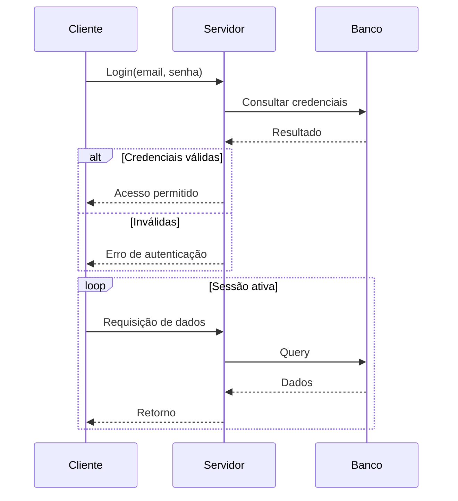
```mermaid
sequenceDiagram
    participant Cliente
    participant Servidor
    participant Banco

    Cliente->>Servidor: Login(email, senha)
    Servidor->>Banco: Consultar credenciais
    Banco-->>Servidor: Resultado

    alt Credenciais válidas
        Servidor-->>Cliente: Acesso permitido
    else Inválidas
        Servidor-->>Cliente: Erro de autenticação
    end

    loop Sessão ativa
        Cliente->>Servidor: Requisição de dados
        Servidor->>Banco: Query
        Banco-->>Servidor: Dados
        Servidor-->>Cliente: Retorno
    end
```

### 8. Gráfico de Gantt com dependências

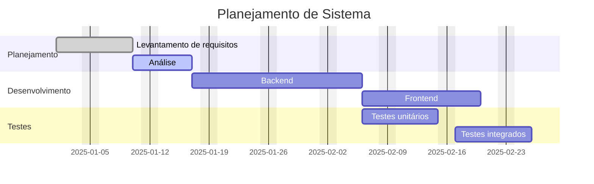
```mermaid
gantt
    dateFormat  YYYY-MM-DD
    title Planejamento de Sistema
    excludes weekends

    section Planejamento
    Levantamento de requisitos :done, a1, 2025-01-01, 7d
    Análise                    :active, a2, after a1, 5d

    section Desenvolvimento
    Backend                    :b1, after a2, 14d
    Frontend                   :b2, after b1, 10d

    section Testes
    Testes unitários           :c1, after b1, 7d
    Testes integrados          :c2, after c1, 7d
```
---

### 9. Diagrama de Fluxo Git

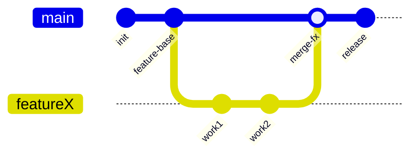
```mermaid
gitGraph
    commit id:"init"
    commit id:"feature-base"
    branch featureX
    checkout featureX
    commit id:"work1"
    commit id:"work2"
    checkout main
    merge featureX id:"merge-fx"
    commit id:"release"
```

### 10. Gráfico de Usuários (Pie Chart)

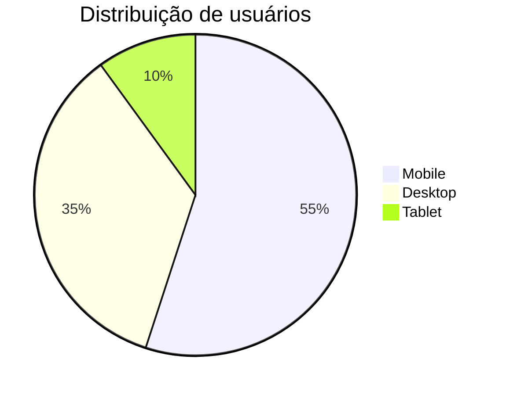
```mermaid
pie title Distribuição de usuários
    "Mobile" : 55
    "Desktop" : 35
    "Tablet" : 10
```

### 11. Git Graph
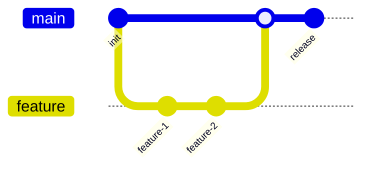
```mermaid
gitGraph
    commit id:"init"
    branch feature
    checkout feature
    commit id:"feature-1"
    commit id:"feature-2"
    checkout main
    merge feature
    commit id:"release"
```
**Git Graph simulando flow de branches**

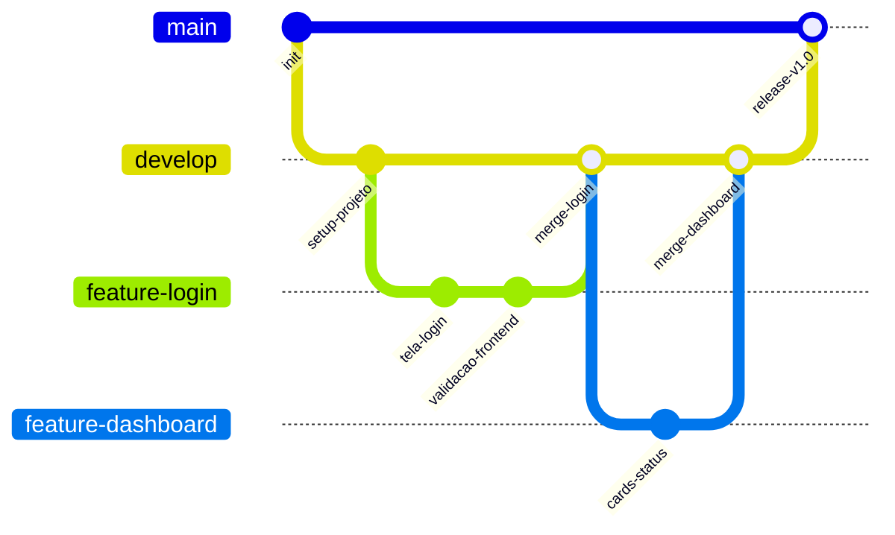
```mermaid
gitGraph
    commit id:"init"
    branch develop
    checkout develop
    commit id:"setup-projeto"
    branch feature-login
    checkout feature-login
    commit id:"tela-login"
    commit id:"validacao-frontend"
    checkout develop
    merge feature-login id:"merge-login"
    branch feature-dashboard
    checkout feature-dashboard
    commit id:"cards-status"
    checkout develop
    merge feature-dashboard id:"merge-dashboard"
    checkout main
    merge develop id:"release-v1.0"
```

### 12. Timeline
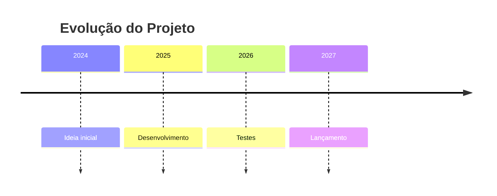
```mermaid
timeline
    title Evolução do Projeto
    2024 : Ideia inicial
    2025 : Desenvolvimento
    2026 : Testes
    2027 : Lançamento
```

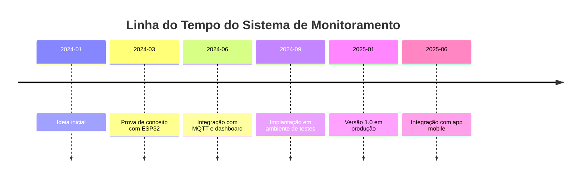
```mermaid
timeline
    title Linha do Tempo do Sistema de Monitoramento
    2024-01 : Ideia inicial
    2024-03 : Prova de conceito com ESP32
    2024-06 : Integração com MQTT e dashboard
    2024-09 : Implantação em ambiente de testes
    2025-01 : Versão 1.0 em produção
    2025-06 : Integração com app mobile
```


### 13. Quadrant Chart com legendas úteis

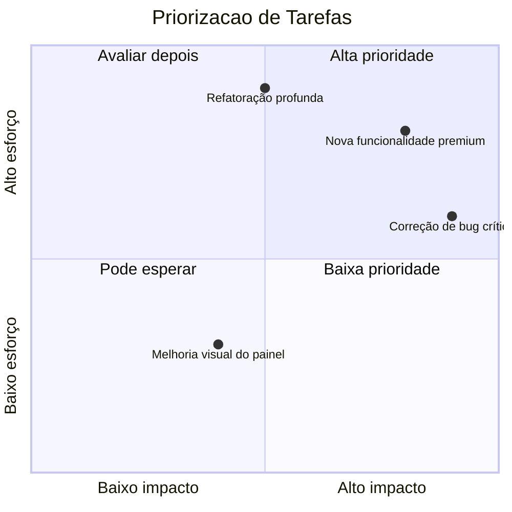
```mermaid
quadrantChart
    title Priorizacao de Tarefas
    x-axis "Baixo impacto" --> "Alto impacto"
    y-axis "Baixo esforço" --> "Alto esforço"
    quadrant-1 Alta prioridade
    quadrant-2 Avaliar depois
    quadrant-3 Pode esperar
    quadrant-4 Baixa prioridade

    "Correção de bug crítico": [0.9, 0.6]
    "Melhoria visual do painel": [0.4, 0.3]
    "Refatoração profunda": [0.5, 0.9]
    "Nova funcionalidade premium": [0.8, 0.8]
```

### 14. Class Diagram com herança, interface e composição

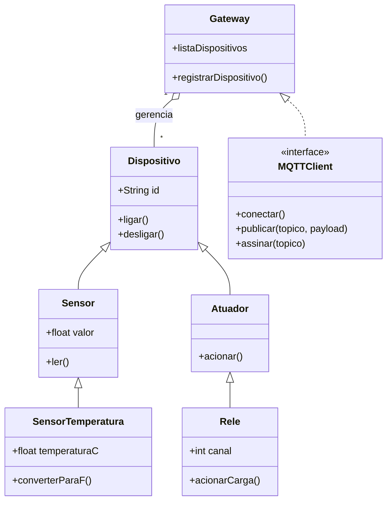
```mermaid
classDiagram
    class Dispositivo {
      +String id
      +ligar()
      +desligar()
    }

    class Sensor {
      +float valor
      +ler()
    }

    class Atuador {
      +acionar()
    }

    class SensorTemperatura {
      +float temperaturaC
      +converterParaF()
    }

    class Rele {
      +int canal
      +acionarCarga()
    }

    class MQTTClient {
      +conectar()
      +publicar(topico, payload)
      +assinar(topico)
    }

    class Gateway {
      +listaDispositivos
      +registrarDispositivo()
    }

    Dispositivo <|-- Sensor
    Dispositivo <|-- Atuador
    Sensor <|-- SensorTemperatura
    Atuador <|-- Rele

    Gateway "1" o-- "*" Dispositivo : gerencia
    Gateway <|.. MQTTClient

    <<interface>> MQTTClient

```

### 15. Gantt Diagram 

```mermaid
%%{init: {'theme':'default'}}%%
gantt
    dateFormat  YYYY-MM-DD
    title Cronograma do Projeto IoT
    excludes weekends

    %% todayMarker não é suportado diretamente no GitHub
    %% Então deixamos desativado mesmo
    todayMarker off

    section Planejamento
    Levantamento de requisitos :a1, 2025-02-01, 7d
    Desenho da arquitetura     :a2, after a1, 5d

    section Desenvolvimento
    Backend (API + MQTT)       :b1, 2025-02-15, 10d
    Firmware ESP32             :b2, after b1, 12d
    Dashboard Web              :b3, 2025-02-20, 14d

    section Testes
    Testes unitários           :c1, after b2, 5d
    Testes de integração       :c2, after c1, 7d
    Homologação               :milestone, c3, 2025-03-15, 0d
```
### 16. Sistema IoT (sensores, MQTT, dashboard, banco de dados)

```mermaid
flowchart LR
    subgraph Dispositivos_IoT
        S1["Sensor Temp Umid 1"]
        S2["Sensor Temp Umid 2"]
        S3["ESP32 - Energia"]
    end

    S1 -->|"MQTT publish /sala1/dados"| BRK[(Broker MQTT)]
    S2 -->|"MQTT publish /sala2/dados"| BRK
    S3 -->|"MQTT publish /energia/dados"| BRK

    subgraph Backend
        SUB["Subscriber MQTT coletor.php"]
        PROC["Processar payloads (normalizar e validar)"]
        DB["Banco de Dados MariaDB"]
    end

    BRK --> SUB
    SUB --> PROC
    PROC -->|"INSERT"| DB

    subgraph Dashboard_Web
        WEB["Frontend HTML JS"]
        API["API REST PHP"]
    end

    WEB -->|"GET /api/dados"| API
    API -->|"SELECT"| DB
    DB --> API
    API --> WEB

    WEB --> USER["Usuario visualiza graficos e alarmes"]

    %% Alarmes
    PROC -->|"Regra de limite excedido"| MQTT_ALR[(MQTT alarme)]
    MQTT_ALR --> ESP_ALR["ESP32 - Aciona sirene"]

```

### 16. Fluxo de autenticação com 2FA, bloqueio e recuperação de conta 


```mermaid
flowchart TD
    START([Início]) --> FORM["Usuário envia usuário e senha"]

    FORM --> AUTH{"Credenciais corretas?"}
    AUTH -->|"Não"| ERRO_LOGIN["Incrementa contador de falhas"]
    ERRO_LOGIN --> LIMITE{"Ultrapassou limite de tentativas?"}

    LIMITE -->|"Sim"| BLOQ["Bloquear conta temporariamente"]
    BLOQ --> MSG_BLOQ["Exibir mensagem de conta bloqueada"]
    MSG_BLOQ --> FIM([Fim])

    LIMITE -->|"Não"| MSG_ERRO["Exibir erro de login"]
    MSG_ERRO --> START

    AUTH -->|"Sim"| VER_2FA{"2FA habilitado?"}
    VER_2FA -->|"Não"| SESSAO["Gerar sessão e token"]
    SESSAO --> DASH["Redirecionar para dashboard"]
    DASH --> FIM

    VER_2FA -->|"Sim"| ENVIA_2FA["Enviar código 2FA via app, SMS ou email"]
    ENVIA_2FA --> FORM_2FA["Usuário digita código 2FA"]
    FORM_2FA --> VALIDA_2FA{"Código 2FA válido?"}

    VALIDA_2FA -->|"Não"| ERRO_2FA["Exibir erro 2FA"]
    ERRO_2FA --> FORM_2FA

    VALIDA_2FA -->|"Sim"| SESSAO

```

---

# Editores Mermaid 

Editores **online** e **offline** para criar diagramas utilizando **Mermaid.js**, incluindo links, recursos e recomendações.


##  Editores Online

### 1. **Mermaid Live Editor (Oficial)**
- 🌐 **URL:** https://mermaid.live
- ✨ Recursos:
  - Edição em tempo real
  - Visualização instantânea
  - Exportação para PNG / SVG
  - Editor oficial da linguagem
- 👍 Recomendado para: testes rápidos e uso geral

---

### 2. **Mermaid Flow**
- 🌐 **URL:** https://www.mermaidflow.app
- ✨ Recursos:
  - Interface moderna
  - Pré‑visualização lado‑a‑lado
  - Exportação simples e limpa
- 👍 Recomendado para: documentação com boa estética

---

### 3. **Mermaid Chart**
- 🌐 **URL:** https://www.mermaidchart.com/play
- ✨ Recursos:
  - Editor avançado
  - Edição colaborativa
  - Exportação profissional
- 👍 Recomendado para: equipes e projetos grandes

---

### 4. **Mermaid Viewer**
- 🌐 **URL:** https://mermaidviewer.com
- ✨ Recursos:
  - Visualizador rápido
  - Exportação em SVG
- 👍 Recomendado para: pré‑visualização simples

---

### 5. **StackEdit**
- 🌐 **URL:** https://stackedit.io
- ✨ Recursos:
  - Markdown com preview Mermaid
  - Sincronização com Google Drive / GitHub
- 👍 Recomendado para: quem escreve grandes documentos em Markdown

---

### 6. **Obsidian (via plugin)**
- 🌐 **URL:** https://obsidian.md
- ✨ Recursos:
  - Suporte integrado a Mermaid
  - Markdown local com preview
- 👍 Recomendado para: documentação pessoal e notas

---

---

## Editores Offline (Desktop)

### 1. **VS Code (com extensão Mermaid)**
- 💻 **URL:** https://code.visualstudio.com
- 🔌 Extensão: *Markdown Preview Enhanced*  
- ✨ Recursos:
  - Renderização local
  - Exportação para PNG / SVG / PDF
- 👍 Recomendado para: quem já usa VS Code

---

### 2. **Typora**
- 💻 **URL:** https://typora.io
- ✨ Recursos:
  - Markdown WYSIWYG
  - Suporte integrado ao Mermaid
- 👍 Recomendado para: quem quer escrever e visualizar tudo no mesmo lugar

---

### 3. **Obsidian (modo offline)**
- 💻 Funciona 100% local
- ✨ Recursos:
  - Suporte ao Mermaid
  - Plugins poderosos
- 👍 Recomendado para: documentação técnica local

---

### 4. **HackMD (modo desktop via Electron)**
- 🌐 **URL:** https://hackmd.io
- ✨ Recursos:
  - Markdown colaborativo
  - Suporte a Mermaid
- 👍 Recomendado para: equipes que editam offline e sincronizam depois

---

### 5. **Zettlr**
- 💻 **URL:** https://zettlr.com
- ✨ Recursos:
  - Editor acadêmico
  - Suporte completo a Markdown + Mermaid
- 👍 Recomendado para: uso profissional e científico

---

---

## 🧭 Qual editor escolher?

| Necessidade | Editor recomendado |
|------------|-------------------|
| Simples e rápido (online) | Mermaid Live Editor |
| Interface moderna | Mermaid Flow |
| Trabalho em equipe | Mermaid Chart |
| Pré‑visualização rápida | Mermaid Viewer |
| Desktop + controle total | VS Code |
| Documentação longa | Typora ou Obsidian |

---
