# Guia para uso de Markdowns para Github

1. [Introdução](#Introdução)
2. [Cabeçalhos](#Cabeçalhos)
3. [Enfase em textos](#Enfase-em-textos)
4. [Blocos de citação](#Blocos-de-citação)
5. [Links](#Links)
6. [Imagens](#Imagens)
7. [Listas Não Ordenadas](#Listas-Não-Ordenadas)
8. [Listas Ordenadas](#Listas-Ordenadas)
9. [Comentários](#Comentários)
10. [Tabelas](#Tabelas)
11. [Lista de Tarefas](#Lista-de-Tarefas)

## Introdução

Markdown é uma linguagem de marcação leve que permite formatar texto de maneira simples e legível, utilizando símbolos e caracteres comuns. Foi criada por John Gruber e Aaron Swartz em 2004, com o objetivo de ser uma linguagem fácil de escrever e de ler em sua forma "bruta", ou seja, sem renderização.

A principal característica do Markdown é que ele pode ser convertido para HTML e outros formatos, permitindo que você escreva documentos que serão exibidos com uma formatação adequada em navegadores ou outras plataformas. Ao mesmo tempo, o texto em Markdown permanece legível e simples, mesmo sem renderização.

Markdown é amplamente usado em plataformas como GitHub, Stack Overflow, editores de textos de desenvolvedores, e sistemas de documentação. É fácil de aprender e ideal para criar conteúdo formatado sem a complexidade de linguagens de marcação mais pesadas, como o HTML.

## Cabeçalhos 

Para cabeçalhos, utilizamos `#` e a cada `#` adicionado representa um nível, indo de 1 a 6, seguindo exemplo abaixo:

# Cabeçalho 1 
## Cabeçalho 2 
### Cabeçalho 3 
#### Cabeçalho 4 
##### Cabeçalho 5 
###### Cabeçalho 6

## Enfase em textos

Para enfase em um texto, podemos utilizar algumas atribuições como: Negrito, Itálico, Riscado... entre outros, conforme exemplo abaixo:

### Negrito

Este é um texto em **negrito** . Para utilizar essa marcação é necessário utilizar a palavra entre asteriscos `**`

### Itálico

Este é um texto em _itálico_. Para utilizar essa marcação é necessário utilizar a palavra entre underlines `_texto aqui_`


### Riscado

Este é um texto em ~~Riscado~~. Para utilizar essa marcação é necessário utilizar a palavra entre til `~~texto_aqui~~`


### Linha horizontal

Se você deseja fazer uma linha horizontal para dividir conteúdos, você pode utilizar `---` ou `___` 

---
 --Texto entre as linhas-- 
___

## Blocos de citação

Esse bloco de citação é criado utilizando o símbolo > no início da linha, e você pode formatar tanto a citação quanto o nome do autor como desejar. A citação é geralmente destacada na renderização com uma barra lateral ou um recuo.

> "A simplicidade é a maior sofisticação."  
> – Leonardo da Vinci


## Links

O texto que queremos utilizar para o link vai entre `[]` e o link vai entre `()` logo após o texto.

[Epaminondas Lage](https://github.com/Epaminondaslage)

Se você deseja adicionar um título par ao link que você está criando (para aparecer quando você posiciona o mouse no link), é só você dar um espaço após o `()` e adicionar o texto do título entre aspas 

[Epaminondas Lage Github](https://github.com/Epaminondaslage) "Pagina do GitHub do Epaminondas"

## Imagens

A imagem deve estar depois de `![texto_legenda]` seguido por entre `()` com o link da imagem.

``````


ou em formato html

```<td style="width: 30%;"></td>```

<td style="width: 30%;"></td>

## Listas Não Ordenadas

Para criação de listas não ordenadas é necessário colocar o asterisco `-  Item` antes do item para criar a lista. Exemplo:

-  Item 1
-  Item 2
-  Item 3

Se você deseja criar ` _sub itens_ `-  dentro da lista, é só realizar a identação na lista, conforme exemplo:

-  Item 1
-  Item 2
  - Sub item 1
    - Sub item 2
       - Sub item 3

## Listas Ordenadas

Para listas ordenadas, é necessário colocar os números `1. Item 1`  antes do item para criar a lista. Exemplo:

1. Primeiro item
2. Segundo item
3. Terceiro item
  
As sublistas são criadas com dois espaços de indentação, mas a numeração é automática.


## Comentários 

Em Markdown, a sintaxe de comentário pode ser feita usando os seguintes padrões, embora comentários não sejam parte oficial do Markdown e não sejam exibidos em muitos renderizadores:


#### Comentário simples (em HTML)

Use a sintaxe de comentário do HTML. Esse tipo de comentário não será exibido no resultado renderizado.

markdown
```
<!-- Este é um comentário e não será exibido -->
```

#### Várias linhas de código em forma de comentário

Para colocar um bloco de códigos em forma comentários, é necessário utilizar  ```html código```  e também é `_recomendado_`  que você coloque a linguagem em que aquele bloco de código está escrito, para facilitar a marcação de palavras reservadas daquela linguagem.

#### Html

```html
<!DOCTYPE html>
<html lang="pt-BR">
<head>
    <meta charset="UTF-8">
    <meta name="viewport" content="width=device-width, initial-scale=1.0">
    <title>Olá, Mundo!</title>
</head>
<body>
    <h1>Olá, Mundo!</h1>
</body>
</html>
```

#### Bash

```bash
ls
pip install pandas
pip install --upgrade --user pandas

```

#### Prompt de Comando

```cmd
cd C:\\User\YourUser\Desktop
mkdir Folder
```

#### Python

```python
# Solicita ao usuário dois números
numero1 = float(input("Digite o primeiro número: "))
numero2 = float(input("Digite o segundo número: "))

# Calcula a soma dos dois números
soma = numero1 + numero2

# Exibe o resultado
print(f"A soma de {numero1} e {numero2} é {soma}.")
```

## Tabelas

Para criar tabelas é necessário utilizar um formato específico para o Github, conforme bloco de códigos abaixo:


| Cabeçalho | Cabeçalho | Cabeçalho |
| --- | --- | --- |
| conteúdo | conteúdo | conteúdo |
| conteúdo | conteúdo | conteúdo |


| Nome | Tipo | Ataque |
| --- | --- | --- |
| Pikachu | Elétrico | 50 |
| Charmander | Fogo | 50 |

## Lista de Tarefas

Para fazer uma lista de tarefas é necessário utilizar um formato específico para o Github, conforme bloco de códigos abaixo:


- [x] Item completado
- [x] Item completado
- [ ] Item não completado


- [x] Criar arquivo guia para Readme no Github
- [x] Commit das mudanças
- [ ] Envio das mudanças para o repositório</pre>


### Uso direto de Emoji
- ⭐ (estrela): ⭐
- 🔥 (fogo): 🔥
- 📞 (telefone): 📞
- 💰 (dinheiro/saco de dinheiro): 💰
- 🏆 (troféu): 🏆
- 🎉 (festa/congratulações): 🎉
- 🔍 (lupa): 🔍
- 🗂️ (pasta de arquivos): 🗂️
- 📨 (carta recebida): 📨
- 📚 (livros/educação): 📚
- 💬 (balão de fala/mensagem): 💬
- 🌟 (estrela brilhante): 🌟
- 🔔 (sino): 🔔
- 🖊️ (caneta): 🖊️
- 📊 (gráfico): 📊
- 🧭 (bússola): 🧭
- 🔗 (corrente/link): 🔗
- 🏁 (bandeira de chegada): 🏁
- 🚧 (construção/obras): 🚧
- 🏠 (casa): 🏠
- 🌍 (globo terrestre/planeta): 🌍
- 📅 (calendário): 📅
- ⏰ (relógio/despertador): ⏰
- 🔋 (bateria): 🔋
- 🎥 (filmadora): 🎥
- 🌊 (onda): 🌊
- 🗳️ (urna de votação): 🗳️
- 🧩 (quebra-cabeça): 🧩
- ✈️ (avião/viagem): ✈️
- ✔️ Marca de verificação
- ❌ X vermelho
- ⚠️ Aviso
- 📅 Calendário
- 📌 Pin de localização
- 📊 Gráfico de barras
- 🔒 Cadeado fechado
- 🔓 Cadeado aberto
- 💡 Ideia
- 📈 Gráfico crescente
- 🔄 Atualizar/reciclar
- 🛠️ Ferramentas/reparo
- 🚀 Foguete/lancamento
- 💾 Salvar/disquete
- 📝 Bloco de notas
- ⏳ Ampulheta
- 🖥️ Computador
- 🌱 Planta/crescimento
- 🎯 Objetivo
- 💻 Laptop
- 📢 Alto-falante/anúncio
- 🔑 (chave): 🔑
- 🛒 (carrinho de compras): 🛒
- ✨ (brilho/efeito mágico): ✨
- 🌞 (sol): 🌞
- 🌜 (lua): 🌜
- 🌀 (ciclone/espiral): 🌀
- ⚙️ (engrenagem): ⚙️
- 🎵 (nota musical): 🎵
- 🌈 (arco-íris): 🌈
- 💦 (gota d'água): 💦
- 🥇 (medalha de ouro): 🥇
- 🍀 (trevo da sorte): 🍀
- 🎁 (presente): 🎁
- 📖 (livro aberto): 📖
- 🚀 (foguete): 🚀
- 🛑 (sinal de pare): 🛑
- 💎 (diamante): 💎
- 🛡️ (escudo): 🛡️
- 💥 (explosão): 💥
- 🚨 (sirene/alerta): 🚨
- 🎈 (balão): 🎈
- 🍎 (maçã): 🍎
- 🎮 (controle de videogame): 🎮
- 🖼️ (quadro/imagem): 🖼️
- 🏋️‍♂️ (levantador de peso): 🏋️‍♂️
- 🚴‍♀️ (ciclista): 🚴‍♀️
- 🐾 (pegadas): 🐾
- ⚖️ (balança/justiça): ⚖️
- 🛏️ (cama): 🛏️
- 🧹 (vassoura): 🧹
- 🥂 (brinde/taças): 🥂
- 🔦 (lanterna): 🔦
- 🗺️ (mapa): 🗺️

--- 


**Gantt (cronograma)**


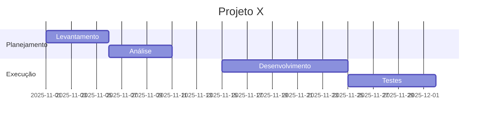
---
**info da versão**

```mermaid
info
```
---


**Flowchart**

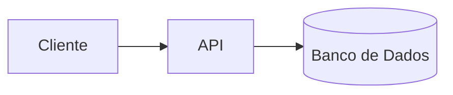

--- 

**Diagrama de sequência**


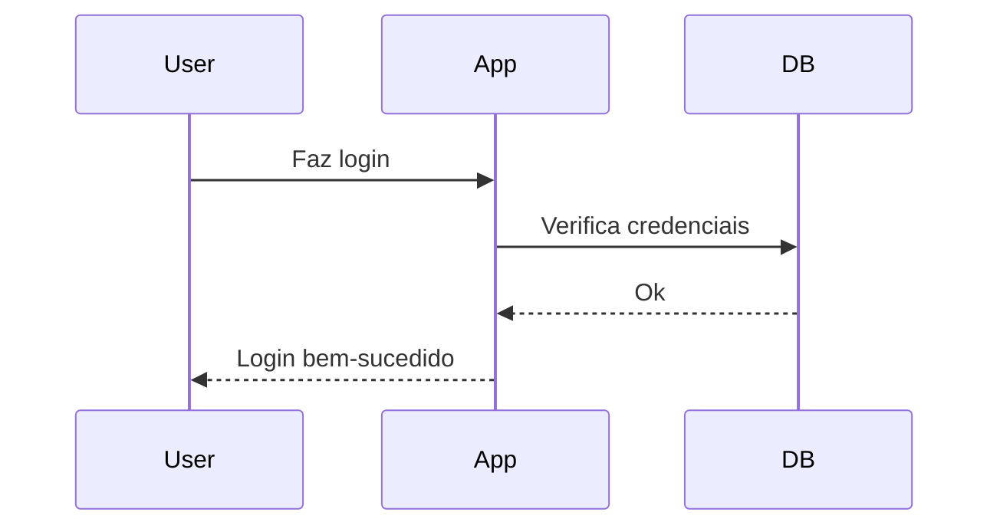

---


Em qualquer arquivo .md (README, por exemplo), escreva assim:

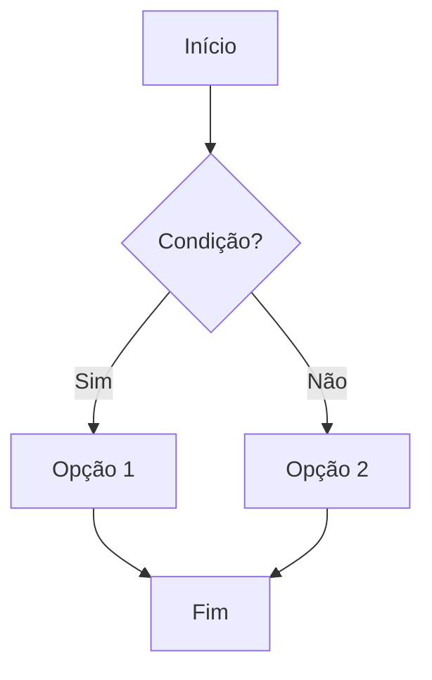

Quando você salva e visualiza o arquivo no GitHub, ele renderiza o **fluxograma**, não o texto.

### 3. Onde isso funciona no GitHub

Você pode usar 

- Arquivos Markdown (`README.md`, docs, etc.)
- Issues
- Pull requests
- Discussions
- Wikis

### 4. Exemplos de tipos de diagrama

Alguns exemplos simples que funcionam direto no GitHub:

**Flowchart**


**Diagrama de sequência**


---

**Gantt (cronograma)**


### 5. Conferir a versão do Mermaid usada pelo GitHub

Se algum recurso novo não renderizar, você pode checar a versão do Mermaid que o GitHub está usando:

```mermaid
info
```

Isso mostra a versão e algumas infos no próprio render do diagrama. :contentReference[oaicite:2]{index=2}  

### 6. Dica prática de fluxo de trabalho

1. **Teste o diagrama no Mermaid Live Editor** (mermaid.live) para ver se a sintaxe está certa. :contentReference[oaicite:3]{index=3}  
2. Quando estiver ok, copie o código.
3. Cole dentro de um bloco ` ```mermaid` no seu `README.md` ou documentação.
4. Commita e veja o resultado no GitHub.

🎨 Exemplos práticos de Mermaid (para usar no GitHub)


1. Fluxograma detalhado (Flowchart com estilos)


2. Diagrama de Classes UML

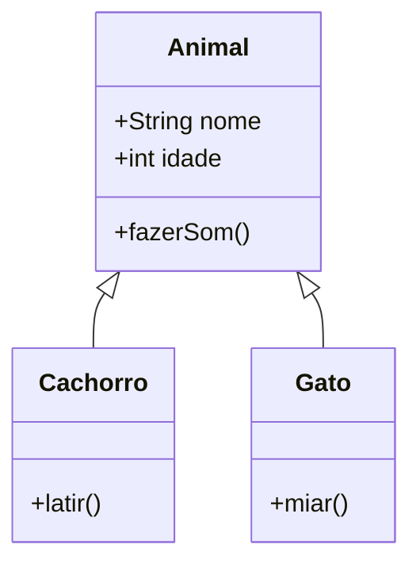
---

3. Diagrama de Estado (State Machine)

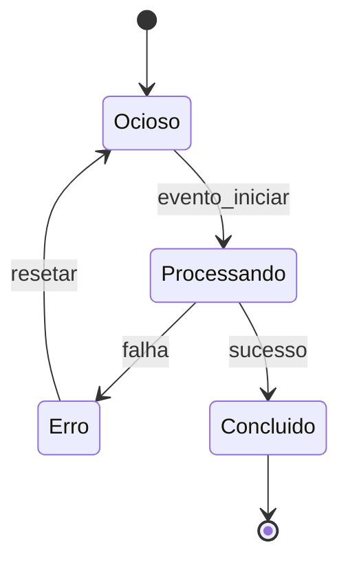

4. Diagrama de Entidade-Relacionamento (ERD)

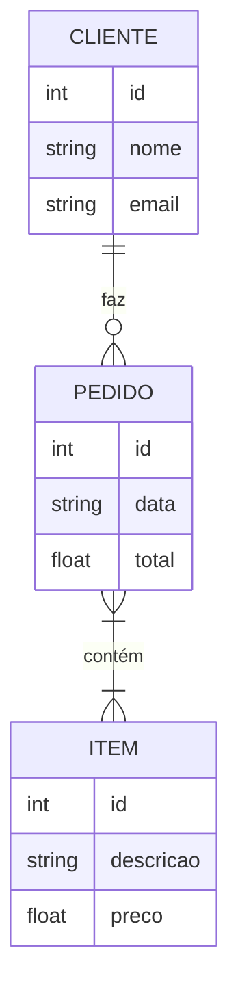

5. Diagrama de Jornada do Usuário

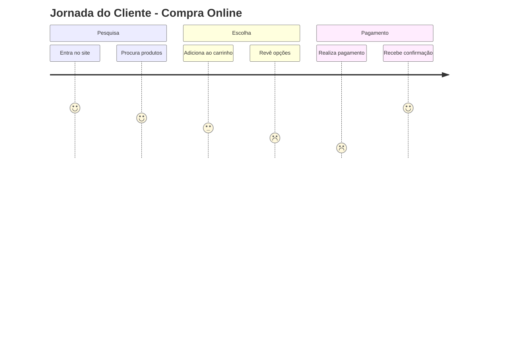
---

6. Mapa Mental (Mindmap)

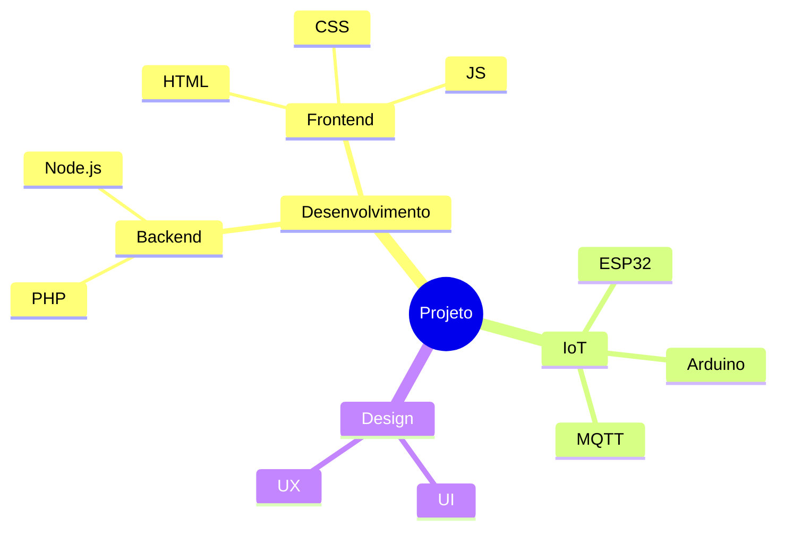
---

7. Diagrama de Sequência com Loop e Condição
   
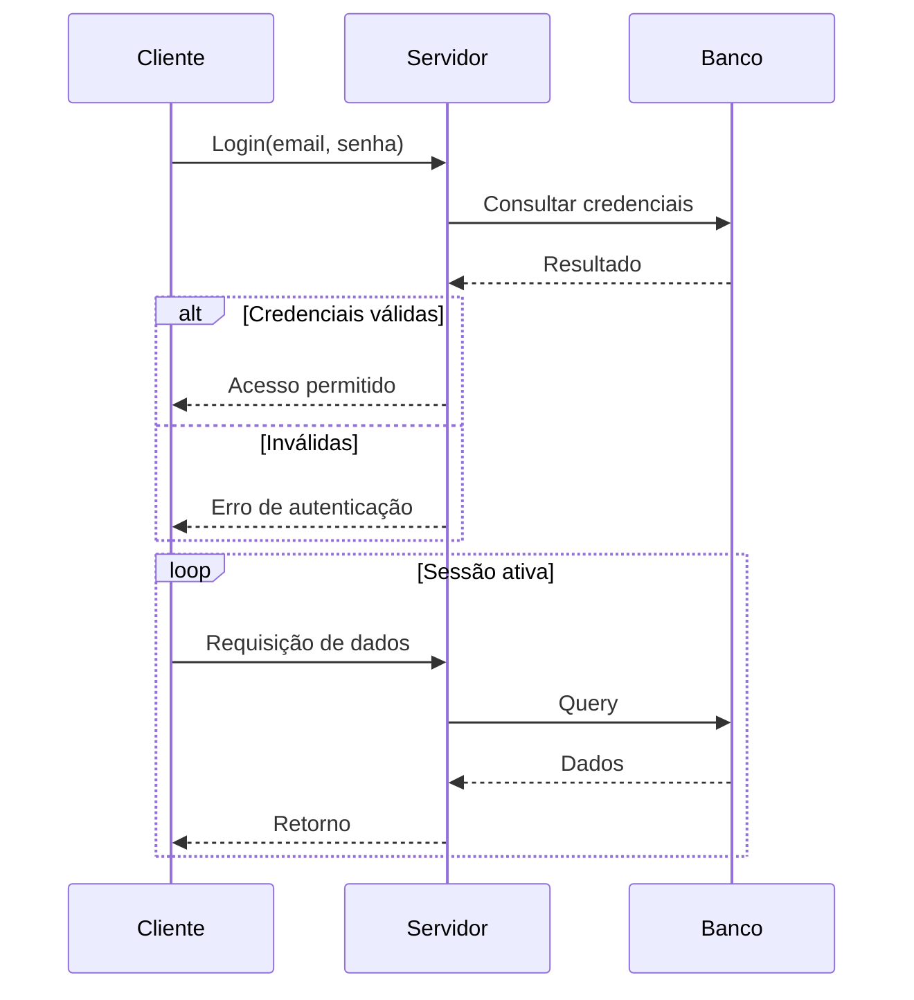

8. Gráfico de Gantt com dependências

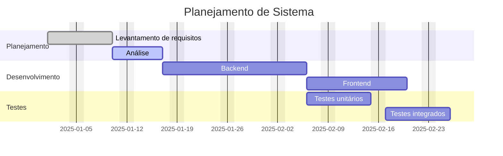
---

9. Diagrama de Fluxo Git

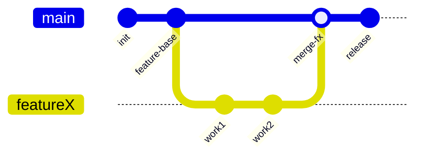

10. Gráfico de Usuários (Pie Chart)

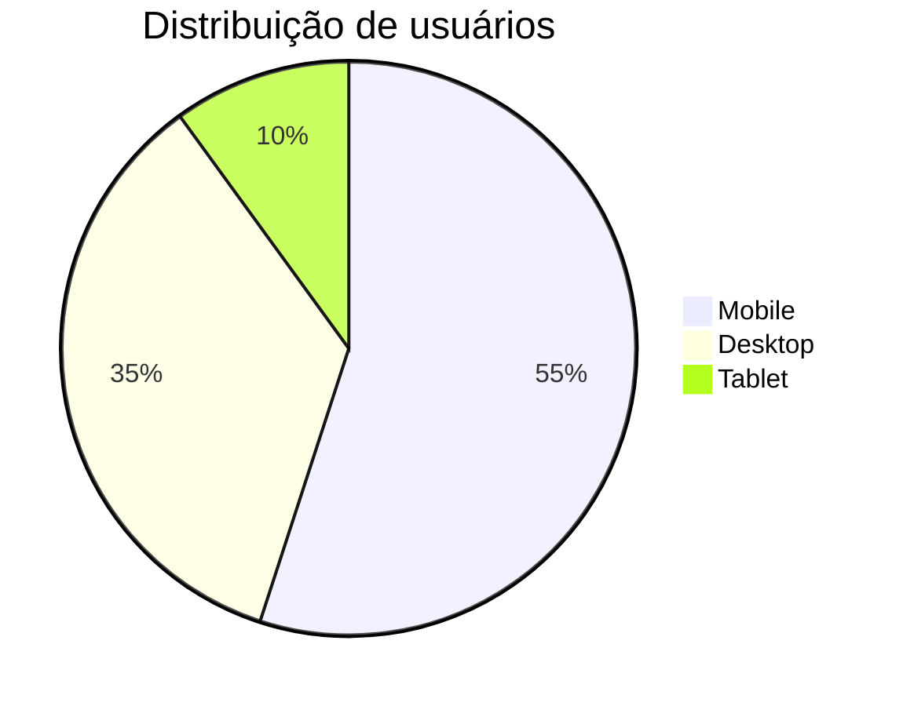
