# Guia para Uso de Markdown no GitHub

## 📑 Índice
1. [Introdução](#introdução)
2. [Cabeçalhos](#cabeçalhos)
3. [Ênfase em textos](#ênfase-em-textos)
4. [Blocos de citação](#blocos-de-citação)
5. [Links](#links)
6. [Imagens](#imagens)
7. [Listas Não Ordenadas](#listas-não-ordenadas)
8. [Listas Ordenadas](#listas-ordenadas)
9. [Comentários](#comentários)
10. [Tabelas](#tabelas)
11. [Lista de Tarefas](#lista-de-tarefas)
12. [Emoji](#emoji)
13. [Mermaid](#mermaid)

---

## Introdução

Markdown é uma linguagem de marcação leve que permite formatar texto de maneira simples e legível, utilizando símbolos e caracteres comuns. Foi criada por John Gruber e Aaron Swartz em 2004...

---

## Cabeçalhos

Para cabeçalhos, utilizamos `#`...

# Cabeçalho 1
## Cabeçalho 2
### Cabeçalho 3
#### Cabeçalho 4
##### Cabeçalho 5
###### Cabeçalho 6

---

## Ênfase em textos

### Negrito  
**texto** → `**texto**`

### Itálico  
_texto_ → `_texto_`

### Riscado  
~~texto~~ → `~~texto~~`

### Linha Horizontal  
`---` ou `___`

---

## Blocos de citação

> "A simplicidade é a maior sofisticação."  
> – Leonardo da Vinci

---

## Links

[Epaminondas Lage](https://github.com/Epaminondaslage)

---

## Imagens

```

```


---

## Listas Não Ordenadas

- Item 1
- Item 2
  - Subitem 1
    - Subitem 2
       - Subitem 3

---

## Listas Ordenadas

1. Primeiro item
2. Segundo item
3. Terceiro item

---

## Comentários

### Comentário HTML

```
<!-- Este é um comentário -->
```

### Exemplos de Código:

#### HTML

```html
<!DOCTYPE html>
<html lang="pt-BR">
<head>
    <meta charset="UTF-8">
</head>
<body>
    <h1>Olá, Mundo!</h1>
</body>
</html>
```

#### Bash

```bash
ls
pip install pandas
```

#### CMD

```cmd
cd C:\\User\\YourUser\\Desktop
mkdir Folder
```

#### Python

```python
numero1 = float(input("Digite: "))
numero2 = float(input("Digite: "))
print(numero1 + numero2)
```

---

## Tabelas

| Nome | Tipo | Ataque |
| --- | --- | --- |
| Pikachu | Elétrico | 50 |
| Charmander | Fogo | 50 |

---

## Lista de Tarefas

- [x] Item completado
- [ ] Item não completado

---

## Emoji

⭐ 🔥 📞 💰 🏆 🎉 🔍 🗂️ 📨 📚 💬 🌟 🔔 🖊️ 📊 🧭 🔗 🏁 🚧 🏠 🌍 📅 ⏰ 🔋 🎥 🌊 🗳️ 🧩 ✈️ ✔️ ❌ ⚠️ 📌 📈 🔄 🛠️ 🚀 💾 📝 ⏳ 🖥️ 🌱 🎯 💻 📢 🔑 🛒 ✨ 🌞 🌜 🌀 ⚙️ 🎵 🌈 💦 🥇 🍀 🎁 📖 🚀 🛑 💎 🛡️ 💥 🚨 🎈 🍎 🎮 🖼️ 🏋️‍♂️ 🚴‍♀️ 🐾 ⚖️ 🛏️ 🧹 🥂 🔦 🗺️

---

# Mermaid

### O que é Mermaid

**Mermaid** é uma **linguagem de marcação baseada em texto** que permite
criar **diagramas e gráficos automaticamente**, muito utilizada em
documentação técnica, especialmente em arquivos Markdown como
`README.md`.

---

###  Definição simples

**Mermaid é uma linguagem que transforma texto em diagramas.**

Você escreve um código simples e o Mermaid renderiza fluxos, UML, mapas
mentais, gráficos, diagramas de estado e muito mais.

---

###  Para que serve

-   Criar **diagramas rápidos** sem ferramentas gráficas.
-   Documentar sistemas, processos e fluxos.
-   Manter diagramas **dentro do próprio código**.
-   Facilitar colaboração em equipes.
-   Automatizar a criação de documentação técnica.

---

### Onde isso funciona no GitHub

Você pode usar 

- Arquivos Markdown (`README.md`, docs, etc.)
- Issues
- Pull requests
- Discussions
- Wikis

---

###  Exemplo de Mermaid

    ```mermaid
    flowchart LR
        A --> B
        B --> C
    ```
---

###  Tipos de diagramas suportados

-   **Flowchart** (Fluxograma)
-   **Sequence Diagram**
-   **Class Diagram (UML)**
-   **ER Diagram**
-   **Gantt Chart**
-   **Mindmap**
-   **State Machine**
-   **User Journey**
-   **Pie Chart**
-   **Git Graph**

---

###  Origem e contexto

Mermaid foi criada para facilitar a criação de diagramas diretamente no
código-fonte, evitando ferramentas externas como Draw.io.\
Hoje é suportada por:

-   GitHub\
-   GitLab\
-   Notion\
-   Obsidian\
-   Vários editores de Markdown


---


Em qualquer arquivo .md (README, por exemplo), escreva assim:

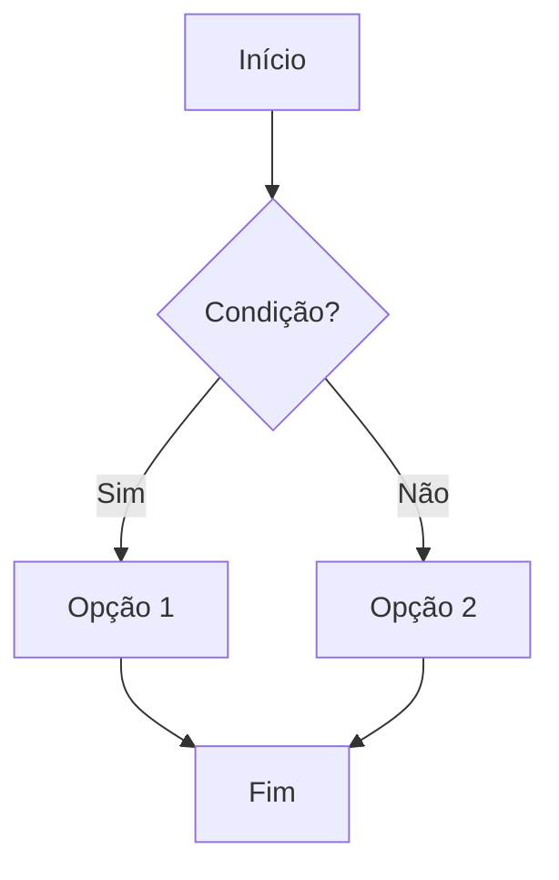

Quando você salva e visualiza o arquivo no GitHub, ele renderiza o **fluxograma**, não o texto.


### Conferir a versão do Mermaid usada pelo GitHub

Se algum recurso novo não renderizar, você pode checar a versão do Mermaid que o GitHub está usando:

```mermaid
info
```

Isso mostra a versão e algumas infos no próprio render do diagrama. :contentReference[oaicite:2]{index=2}  

### Dica prática de fluxo de trabalho

1. **Teste o diagrama no Mermaid Live Editor** (mermaid.live) para ver se a sintaxe está certa. :contentReference[oaicite:3]{index=3}  
2. Quando estiver ok, copie o código.
3. Cole dentro de um bloco ` ```mermaid` no seu `README.md` ou documentação.
4. Commita e veja o resultado no GitHub.

###  Exemplos práticos de Mermaid (para usar no GitHub)


### 1. Fluxograma detalhado (Flowchart com estilos)

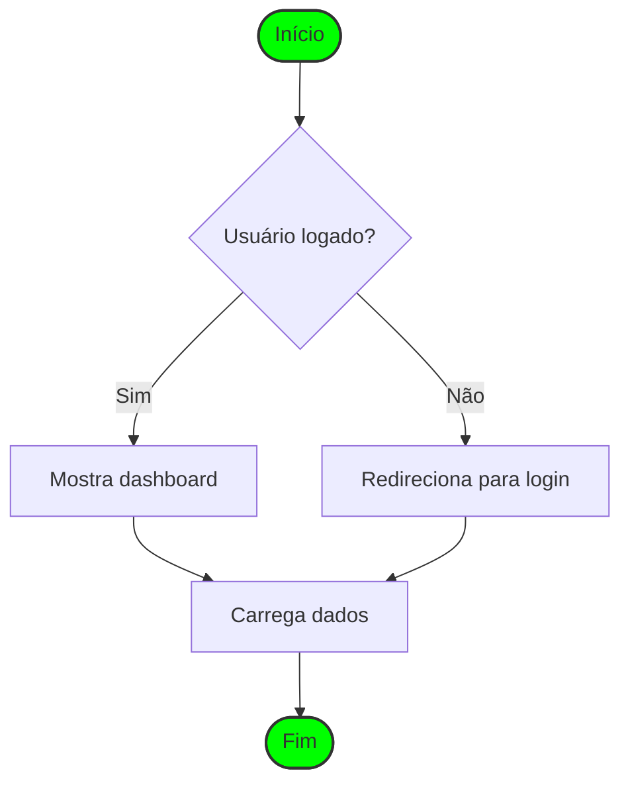

### 2. Diagrama de Classes UML

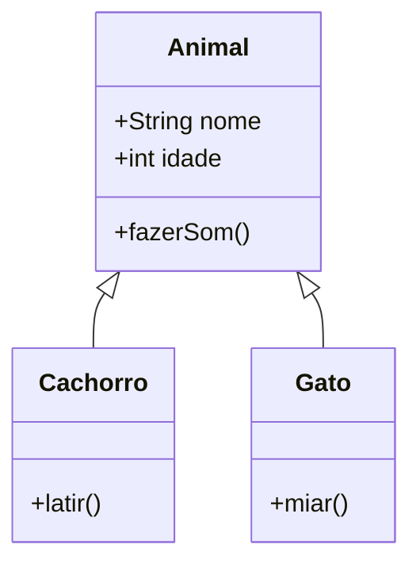
---

### 3. Diagrama de Estado (State Machine)

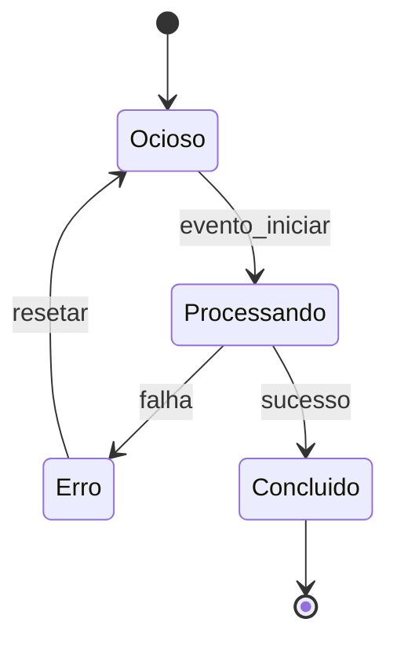

### 4. Diagrama de Entidade-Relacionamento (ERD)

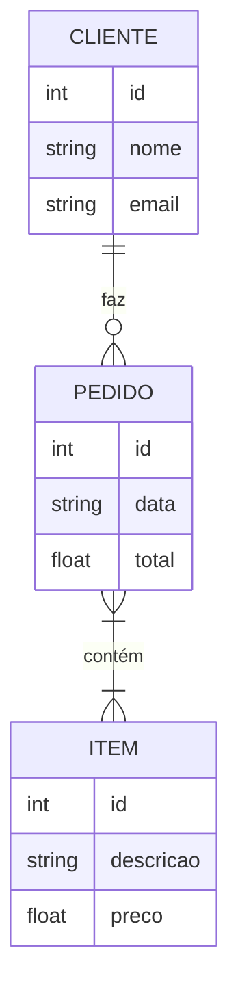

### 5. Diagrama de Jornada do Usuário

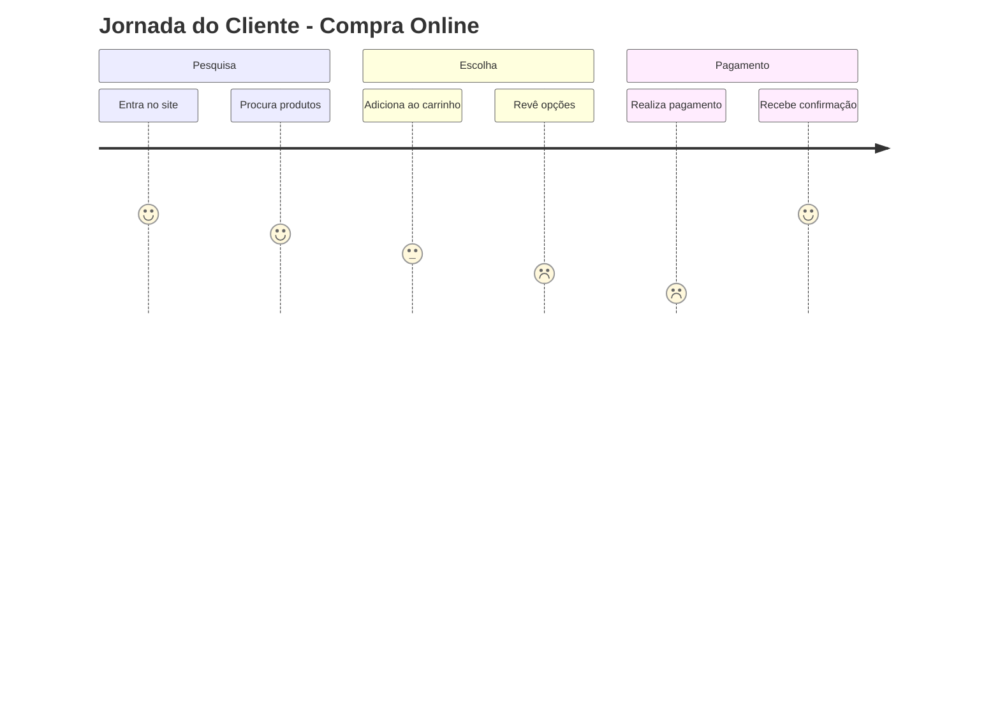
---

### 6. Mapa Mental (Mindmap)

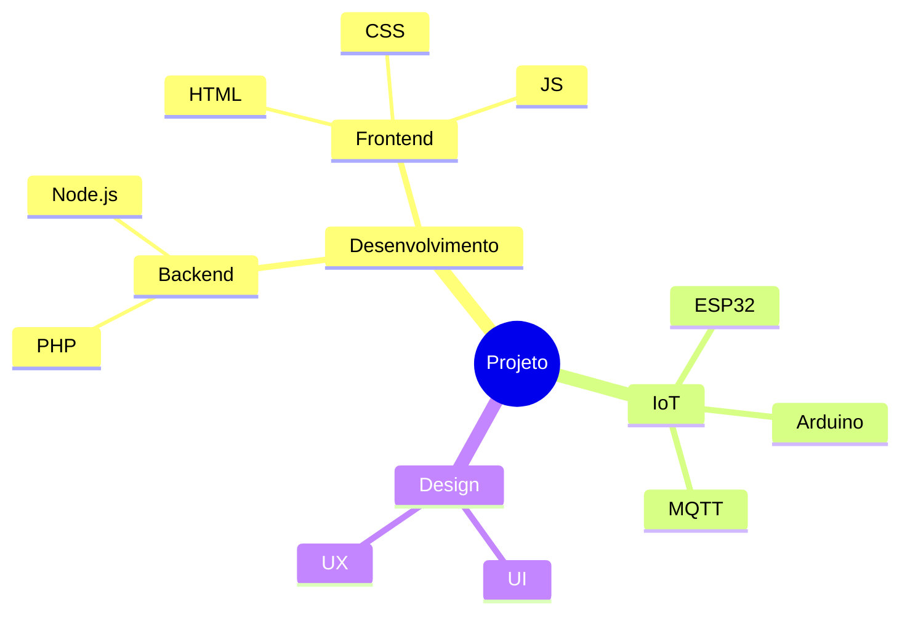
---

### 7. Diagrama de Sequência com Loop e Condição
   
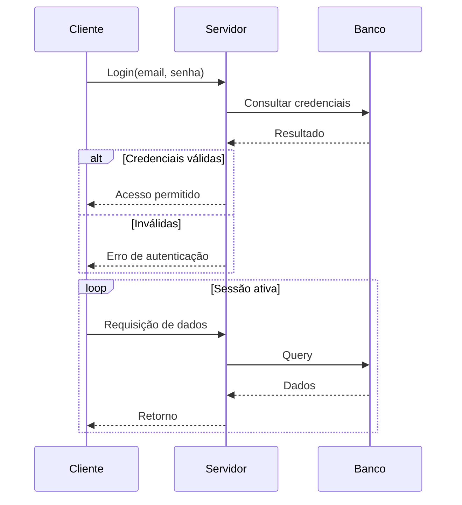

### 8. Gráfico de Gantt com dependências

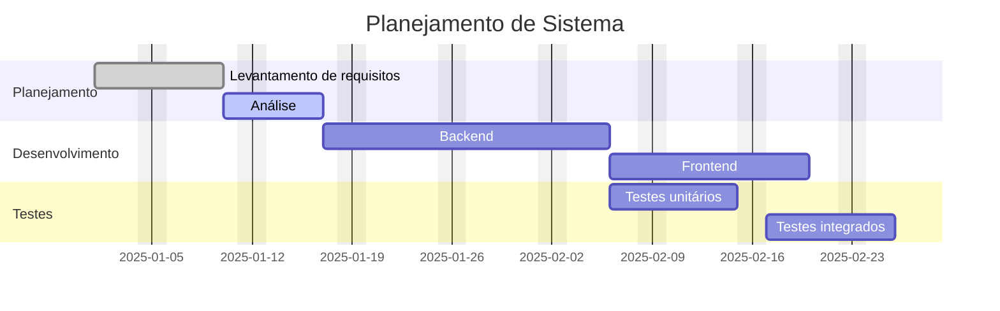
---

### 9. Diagrama de Fluxo Git

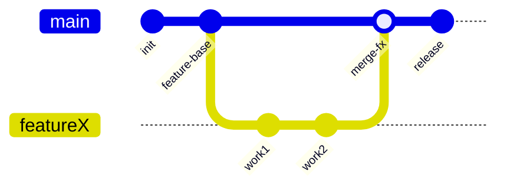

### 10. Gráfico de Usuários (Pie Chart)

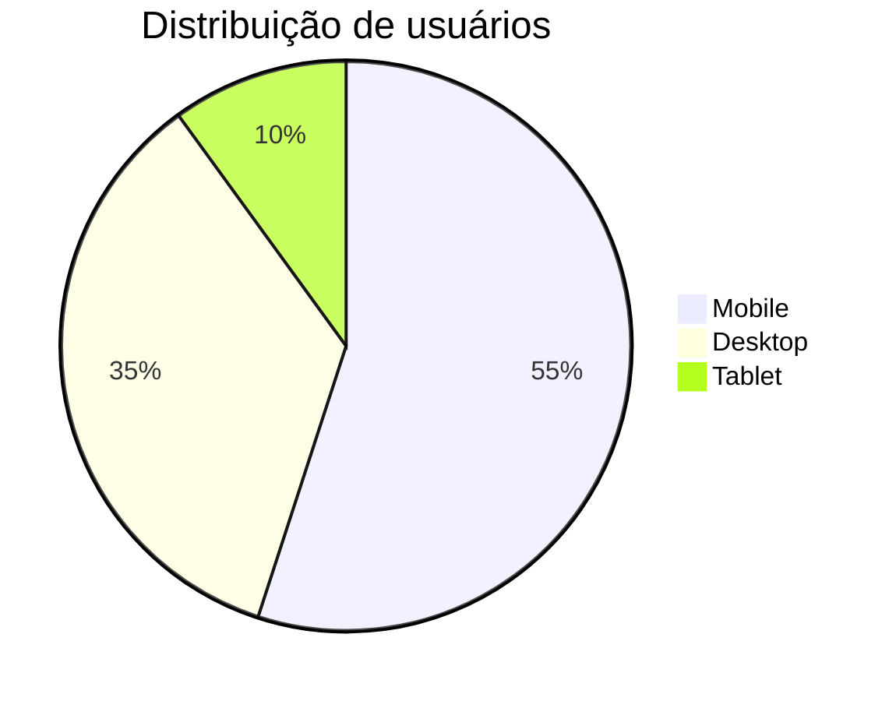

### 11. Git Graph
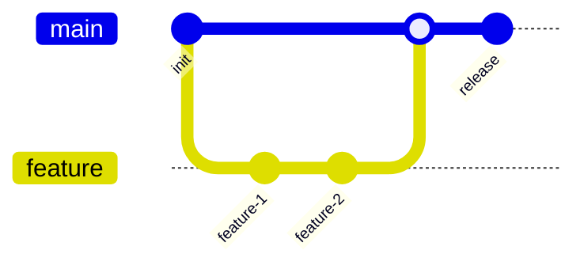

### 12. Quadrant Chart
```mermaid
quadrantChart
    title Matriz de Prioridade
    x-axis Baixa --> Alta
    y-axis Fácil --> Difícil

    A[Melhorias simples] : 0.2 : 0.3
    B[Tarefas rápidas] : 0.7 : 0.2
    C[Projetos grandes] : 0.8 : 0.8
    D[Ganhos médios] : 0.3 : 0.7
```

### 13. Timeline
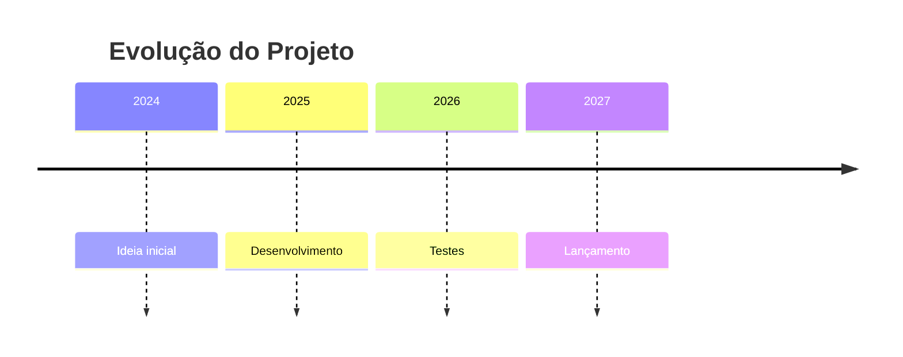
