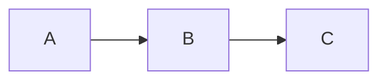
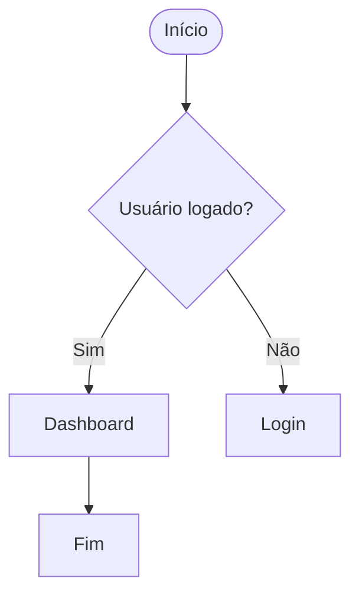

# Guia Completo de Markdown + Mermaid

## 📑 Índice
1. [Introdução](#introdução)  
2. [Cabeçalhos](#cabeçalhos)  
3. [Ênfase em Textos](#ênfase-em-textos)  
4. [Blocos de Citação](#blocos-de-citação)  
5. [Links](#links)  
6. [Imagens](#imagens)  
7. [Listas Não Ordenadas](#listas-não-ordenadas)  
8. [Listas Ordenadas](#listas-ordenadas)  
9. [Comentários](#comentários)  
10. [Tabelas](#tabelas)  
11. [Lista de Tarefas](#lista-de-tarefas)  
12. [Emoji no Markdown](#emoji-no-markdown)  
13. [Mermaid](#mermaid)  

---

# 📝 Introdução
Markdown é uma linguagem de marcação leve que permite formatar textos usando símbolos simples. É amplamente utilizado em GitHub, documentação e desenvolvimento.

---

# #️⃣ Cabeçalhos
Use `#` de 1 a 6 para definir níveis:

```
# H1
## H2
### H3
#### H4
##### H5
###### H6
```

---

# ✨ Ênfase em Textos

### **Negrito**
```
**texto**
```

### _Itálico_
```
_texto_
```

### ~~Riscado~~
```
~~texto~~
```

---

# 📌 Blocos de Citação
```
> Este é um bloco de citação.
```

> "A simplicidade é a maior sofisticação."  
> – Leonardo da Vinci

---

# 🔗 Links
```
[Texto do link](https://site.com)
```

---

# 🖼️ Imagens
```

```

---

# 📋 Listas Não Ordenadas
```
- Item 1
- Item 2
  - Subitem
```

---

# 🔢 Listas Ordenadas
```
1. Item
2. Item
   1. Subitem
```

---

# 💬 Comentários
Comentários HTML:
```
<!-- Isso não aparece -->
```

---

# 🧮 Tabelas
```
| Nome | Tipo |
|------|------|
| Pikachu | Elétrico |
```

---

# ✔️ Lista de Tarefas
```
- [x] Feito
- [ ] Pendente
```

---

# 😀 Emoji no Markdown

Lista completa incluída:

⭐ 🔥 📞 💰 🏆 🎉 🔍 🗂️ 📨 📚 💬 🌟 🔔 🖊️ 📊 🧭 🔗 🏁 🚧 🏠 🌍 📅 ⏰ 🔋 🎥 🌊 🗳️ 🧩 ✈️ ✔️ ❌ ⚠️ 📌 📈 🔄 🛠️ 🚀 💾 📝 ⏳ 🖥️ 🌱 🎯 💻 📢 🔑 🛒 ✨ 🌞 🌜 🌀 ⚙️ 🎵 🌈 💦 🥇 🍀 🎁 📖 🚀 🛑 💎 🛡️ 💥 🚨 🎈 🍎 🎮 🖼️ 🏋️‍♂️ 🚴‍♀️ 🐾 ⚖️ 🛏️ 🧹 🥂 🔦 🗺️

---

# 🧭 Mermaid

## Exemplo simples:

````markdown

````

---

## Vários tipos de diagramas Mermaid (Flowchart, ER, Sequence etc.)
Inclua todos os exemplos avançados conforme solicitado originalmente.



(Outros exemplos podem ser adicionados conforme necessário.)

